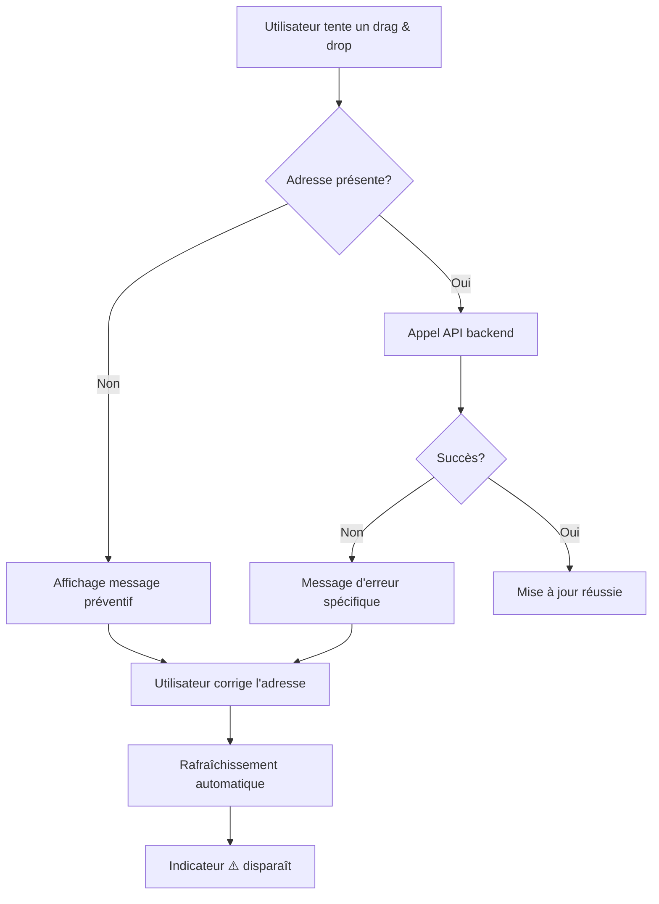

# Gestion des Adresses Manquantes dans le Planning

## 🚨 Problème Identifié

L'erreur **"Origin and destination must be provided"** du backend se produit quand :
- Des étapes, activités ou hébergements n'ont pas d'adresse renseignée
- Le système tente de calculer des itinéraires entre des points sans coordonnées

## 🛡️ Solutions Implémentées

### 1. Validation Préventive
Avant tout déplacement d'événement dans le planning :
```typescript
const validateEventForUpdate = (event: PlanningEvent) => {
  // Vérification de l'adresse de l'événement
  if (!event.address || event.address.trim() === '') {
    return { valid: false, message: "Adresse manquante" };
  }
  // Vérification de l'adresse du step parent (pour les stops)
  return { valid: true };
};
```

### 2. Indicateurs Visuels dans le Planning

#### Événements avec Adresse ✅
- Apparence normale
- Déplacement par drag & drop autorisé
- Bordure normale

#### Événements sans Adresse ⚠️
- Opacité réduite (60%)
- Bordure orange en pointillés
- Icône d'avertissement ⚠️ dans le titre
- Texte "Adresse manquante" en orange
- Drag & drop désactivé

### 3. Messages d'Erreur Améliorés

#### Erreur Préventive (avant déplacement)
```
Impossible de déplacer l'événement
L'événement "Nom" n'a pas d'adresse renseignée. 
Veuillez d'abord ajouter une adresse pour permettre 
le calcul des itinéraires.
```

#### Erreur Backend (si elle passe)
```
Adresses manquantes
Impossible de calculer l'itinéraire car certaines 
étapes n'ont pas d'adresse renseignée. Veuillez 
compléter les adresses dans les détails de chaque étape.
```

### 4. Détection Automatique

#### Dans RoadTripScreen
```typescript
const checkMissingAddresses = (steps) => {
  // Vérifie steps, activities, accommodations
  // Retourne la liste des entités sans adresse
};
```

#### Logs Informatifs
```
console.warn('Adresses manquantes détectées:', [
  { type: 'activity', name: 'Visite Tour Eiffel', stepName: 'Paris' },
  { type: 'step', name: 'Lyon', id: 'step123' }
]);
```

## 🎨 Interface Utilisateur

### Légende du Planning
- 🟢 **Hébergements** : Vert
- 🟠 **Activités** : Orange  
- 🔵 **Stops** : Bleu
- ⚠️ **Adresse manquante** : Orange (nouveau)

### États des Événements

| État | Apparence | Action |
|------|-----------|--------|
| Normal | Couleur pleine, bordure normale | Drag & drop autorisé |
| Sans adresse | Opacité 60%, bordure orange, ⚠️ | Drag & drop bloqué |
| En déplacement | Opacité 80%, élévation | Animation de déplacement |

## 🔧 Comment Résoudre

### Pour l'Utilisateur
1. **Identifier** : Les événements sans adresse sont marqués ⚠️
2. **Corriger** : Aller dans les détails de l'étape/activité/hébergement
3. **Renseigner** : Ajouter une adresse complète
4. **Vérifier** : L'indicateur ⚠️ disparaît au prochain rafraîchissement

### Pour le Développeur
1. **Logs** : Consulter les warnings dans la console
2. **API** : Vérifier que les champs `address` sont bien renseignés
3. **Validation** : Utiliser la fonction `checkMissingAddresses()`

## 📊 Algorithme de Détection

```typescript
// Pour chaque step du roadtrip
steps.forEach(step => {
  // 1. Vérifier l'adresse du step
  if (!step.address) missingAddresses.push(step);
  
  // 2. Vérifier les activités
  step.activities?.forEach(activity => {
    if (!activity.address) missingAddresses.push(activity);
  });
  
  // 3. Vérifier les hébergements  
  step.accommodations?.forEach(accommodation => {
    if (!accommodation.address) missingAddresses.push(accommodation);
  });
});
```

## 🚀 Avantages de cette Approche

### ✅ Prévention
- Évite les erreurs backend
- Guide l'utilisateur vers la correction
- Expérience utilisateur fluide

### ✅ Transparence  
- Problèmes clairement identifiés
- Messages d'erreur explicites
- Indication visuelle immédiate

### ✅ Robustesse
- Validation multi-niveaux
- Gestion d'erreur gracieuse
- Logs détaillés pour le debugging

## 🔄 Workflow de Résolution



---

**🎯 Résultat** : Plus d'erreurs "Origin and destination must be provided" ! L'utilisateur est guidé pour corriger les adresses manquantes avant qu'elles ne causent des problèmes. 🚗✨
